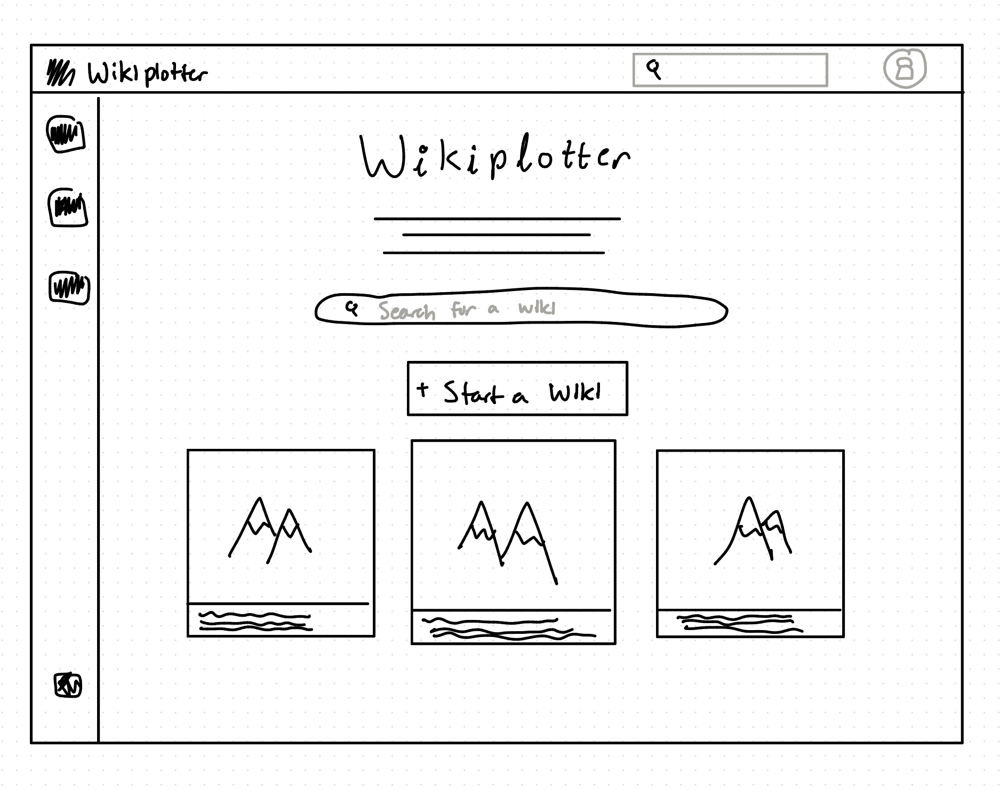
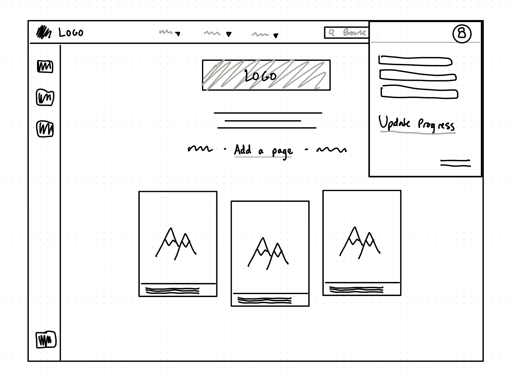
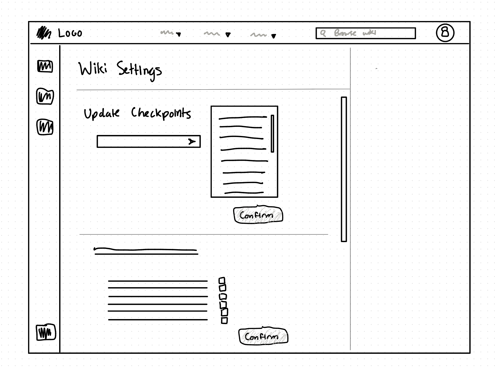
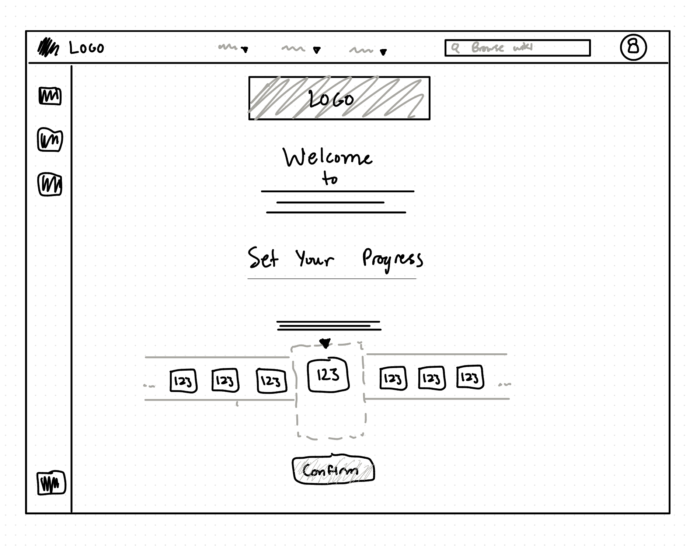
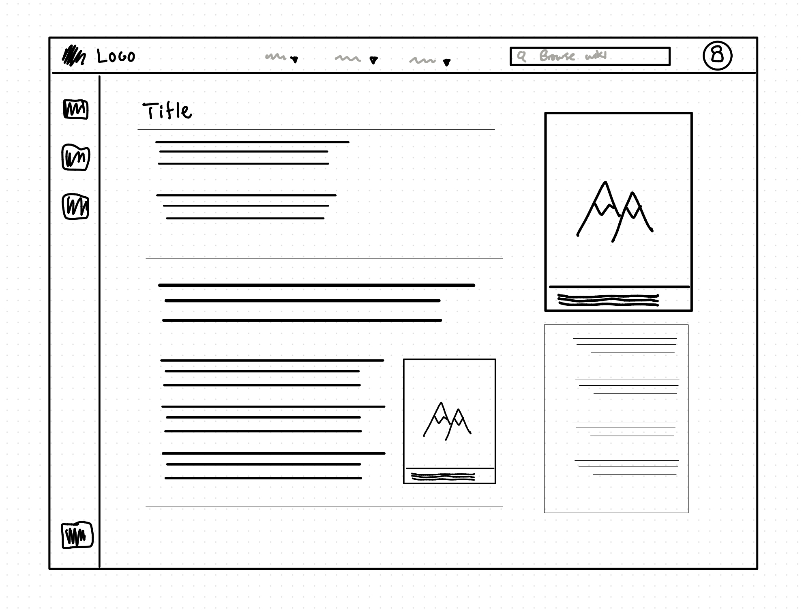

# Wikiplotter

## Problem Statement

### Domain 
Spoiler-aware narrative fiction wikis; narrative fiction is an umbrella term describing the genre for imagined stories told in an event-centric fashion. The beauty of narrative fiction is often found in getting absorbed in a story told in a way such as to only be able to unravel more about the world the further one reads. This is characterized by unknowns surrounding various events, or events which simply haven't occurred yet chronologically, which are important to the author's intended narrative to be carefully explored in their original order, delivering the best (or at least, most authentic) experience possible to readers. Accompanying a piece of narrative fiction can also be a vibrant community of readers who enjoy consolidating information about the story (e.g. character profiles, event timelines, etc.) in an online hub, known as a "**wiki.**"

Unfortunately, as a central hub of information, the wiki is also home to "spoilers," those important narrative unknowns which can be detrimental to the reading experience if revealed prematurely to a new reader. In general, most readers tend to value a spoiler-free experience. However, it's also not uncommon for excited readers to get ahead of themselves for whatever reason, and stumble upon a random spoiler for their latest read. Whether it be via a Google Search, through practiced wiki surfing, or unexpected online discussion, there are never any guarantees that the next page one clicks is spoiler-free. Just a single sentence or image can convey a spoiler that the reader carries with them for the rest of their experience. 

### Bad Situations 
The following are potential, slightly exaggerated, made-up scenarios:

1. *Art contains spoilers or is spoiler-adjacent.* Alice has recently picked up The Adventures of the Red Dragon. She's only at around chapter 20, and most of the story has revolved around setting the scene and building up a picture of the world and its characters. In particular, Alice has fallen in love with the image of the Red Dragon in her mind and can't hold herself back from searching up official or fan-made art of the Red Dragon to compare with her own mental image. However, the first result in Google Image Search is a beautiful fan-made piece depicting the Red Dragon... holding her dead brother in her arms. A pivotal turning point in the later chapters has been irreversibly placed in Alice's mind to carry for the rest of her read. 

2. *Reading a spoiler while referring to the wiki.* Bob has also started reading The Adventures of the Red Dragon. Compared to Alice, Bob is much further along and has managed to steer clear of any spoilers until around chapter 50. However, the world of the dragons is incredibly vast and the author packed it with details. Bob recalls a particular plot-relevant detail about an item introduced early on and thinks it's worth searching the wiki to confirm it. Unfortunately, even as experienced as he is at browsing wikis, upon finding the relevant sentence in the wiki, he accidentally reads the next sentence spoiling its major upcoming plot relevance. Reading this plot twist, Bob now knows exactly how events will unfold around this item, making his usual speculation far less enjoyable. 

3. *A spoiler-free page contains unexpected spoilers.* While reading The Adventures of the Red Dragon, Charlie suddenly becomes curious about how two characters are related. He finds a wiki page labeled "Spoiler-free Character Guide" and immediately thinks he's found what he's looking for. Unfortunately, while the character descriptions indeed don't contain any spoilers, a couple of hyperlinks and art on the page leak plot-relevant information on the characters. Charlie has no been exposed to the very information he trusted this page to protect against. 

4. *A spoiler warning doesn't account for individual reading progress.* Dana is up to chapter 70 of The Adventures of the Red Dragon and halfway through the chapter, she feels like it's worth revisiting an explanation of how magic works in this world. She finds the relevant wiki article on magic, and it's labeled with a spoiler warning. Having already read through important scenes and thinking she's far enough ahead in the story, she bypasses the spoiler warning to see the full article. While most of the article is familiar, she stumbles upon a major secret about the magic system not revealed until chapter 100, much to her dissatisfaction. Despite there being a spoiler warning, this binary signal simply provided no useful way to determine how appropriate the article's full contents were for Dana's individual reading progress.

### Corroboration 
- **Personal experience** with reading narrative fiction and frequently referring back to the openly-contributed wiki lends to a personal desire for wikis which enforce better spoiler-protection. Every wiki is different in their own way, and contributors don't always set up these protections.

-  [Reddit - how do I forget a major spoiler?](https://www.reddit.com/r/OmniscientReader/comments/1wy3y8n/how_do_i_forget_a_major_orv_spoiler_help_me/) Readers of the popular webnovel "Omniscient Reader's Viewpoint" often complain about stumbling upon spoilers while reading. Especially with the novel's rise in popularity and sprawling fanbase, many spoilers float freely online and easily come up even in only vaguely-related searches. 

-  [Spoiler Alert! - On the Modern Problem of Spoilerphobia](https://reactormag.com/spoiler-alert-on-the-modern-problem-of-spoilerphobia/) In a different light, this article talks about the culture of "spoilerphobia," understanding the importance of narrative revelations but also resenting the emphasis placed on censorship for the sake of preserving these revelations. From a different perspective, this can be viewed as corroboration for a certain desire for anxiety-free discussion where one doesn't need to worry about spoilers (although, the article advocates for not caring so much about spoilers in general). 

    Some comments under the article express agreement with seeing more, unexpected modern hysteria around spoilers. Others also point to the value of spoilers, helping them to avoid wastes of time and read stories stress-free. Other comments corroborate the idea that readers still value a good first-time experience without knowing what happens next. 

### Workarounds and comparables 
1.  [Spliki](https://spliki.com) was a spoiler-free wiki for a long time before shutting down.
 
2.  [Without Spoilers](https://withoutspoilers.com) appears to be a wiki site with a collection of various narrative works where users can input their own reading progress before gaining access to the wiki's entry for that work. Articles appear based on whether your reading progress has reached a certain point, and the site also provides event timelines according to the same rules. Within articles themselves, certain sections also remain unlocked if your progress hasn't reached a certain point. 

    However, Without Spoilers provides a limited framework for developing a wiki without spoilers. Its rigidity is seen in the way that articles only reveal themselves incrementally based on your chronological reading progress, ignoring the non-chronological nature of relevant sections in any given article. Moreover, the style is uniform across the website, suggesting a lack of open contributor support. 

3.  [Malazan Wiki](https://malazan.fandom.com/wiki/Malazan_Wiki:New_Readers_Zone) is a Fandom wiki contributed to by the Malazan fanbase with a specially curated spoiler-free section for new readers. Moreover, fan-made art, chapter summaries, and the like which comprise many pages of the wiki undergo a vetting process around keeping pages safe. This wiki is a great example of organizational efforts to keep a reading experience spoiler-free and enjoyable for new readers. Unfortunately, this experience is limited to a single franchise, Malazan, and the platform it is built on, Fandom, doesn't offer native spoiler protections. However, a similar framework might be adapted for all-purpose use. 

### Solution sketch
I propose a web application similar to the service provided by Fandom for creating wikis that can be openly contributed to. Unlike Fandom, [Insert Name] will be more opinionated, and provides a framework for contributors to produce articles as long as they follow the guidelines for spoiler-free article creation. 

In order to address the issue of producing of spoiler-free articles, this framework forces contributors to identify "checkpoints" for every piece of media they contribute to the wiki. Contributors have the freedom to decide the scope of media which their checkpoints affect, i.e. they can tag sentences, paragraphs, blurbs, sections, images, or even an entire article itself. For every wiki user, their individual reading progress can be checked against these checkpoints in order to decide which media should be made available to them. 

The web application produces a wiki for every series, known as a hub. Every hub defines their own unique wiki for a piece of narrative fiction, and is freely customizable by design. Main contributors for a hub can retain control over the finer details of configuring spoiler handling, as well as can freely define contribution guidelines for their wiki. Human-defined rules and behaviors are not intended to be strictly checked against, but rather guide their hub's contributors and users to navigate the provided framework. Within this framework, every hub defines its own checkpoints, is able to develop a graph-like timeline for safe wiki surfing, and dedicates an article to onboarding new readers. 

#### Stakeholders
- **Readers**: Readers are the end-users we want to benefit directly from a spoiler-aware wiki, as there are many reasons a reader might want to explore a wiki, even at the risk exposure to spoilers.
- **Creators**: Creators of narrative fiction are secondary users we want to receive passive benefits from having a trustworthy, user-friendly wiki as a hub of information for their source work, creating a place of value for their community to contribute to.
- **Wiki Contributors**: Wiki contributors make up the other half of the end-users, which may overlap with readers and creators, whom we want to benefit from having a framework for managing safe, spoiler-aware contributions to a wiki.

## Pitch 
### Wikiplotter
**Motivation:** Narrative fiction enjoyers want to browse a centralized hub for a given series, and want to do so without worrying about revealing information (spoilers) beyond their current reading progress.

Wikiplotter is the wiki creation platform for narrative fiction that protects its readers from spoilers, on every hub. As a wiki community grows, you don't need to worry about growing the spoiler tags with it. Instead of expecting readers to be seasoned wiki navigators--dodging spoiler warnings and having to guess which unmarked pages are safe--Wikiplotter enforces all of its hosted articles to adopt what we call "checkpoint" tags, allowing information to be filtered based on reading progress. 

**Progress Tracking**. Before entry into any series hub, users can identify their reading progress by selecting their latest chapter completed. Wikiplotter then remembers that information and uses it to filter out information on every article the user visits. As readers advance through the series, they have the option to update their reading progress as well and previously unavailable relevant information will become revealed to them. This circumvents the need for spoiler warnings, and returns control to the readers. 

**Granular Filtering**. Articles on the wiki can have varying levels of protection, from the article itself down to individual passages or sentences. A reader can browse the basic information on an article for an item that has been introduced early on, while any passages related to its later significance remain hidden to them. If a reader wants to see portraits of a character introduced in Chapter One, they can search for their images without fear of stumbling upon art of a future event. Whether it be paragraphs, headings, titles, images, or captions, readers are given safety guarantees on the content that they are allowed to see. Contributors only need to maintain the references on a single article. Wikiplotter does all the rest.

**Uniquely Yours**. Every wiki hub is different, because every story is different. Like any other wiki, one created with Wikiplotter is an open contribution project. We provide the framework, you have the freedom to build around it. Contributors take upon the responsibility of setting up the hub's introduction page, managing contribution guidelines, and defining the series' checkpoints. For contributors, the benefit is only needing to identify spoilers and assign checkpoints once, and they can trust Wikiplotter to handle the work of protecting readers. For creators, an online space unique to their universe can also be a safe place for the community to document and discuss their favorite series. 

Wikiplotter redefines the wiki into a friendly companion that follows the reader as the story unfolds, useful and welcoming rather than potentially dangerous. 

## Concept Specification (MVP)
1.  **concept** Checkpointing [Scope]  
    **purpose** define a sequence of reference points which can be interpreted unambiguously under a certain scope.  
    **principle** after an organizer creates a sequence and appends checkpoints to it, identifying any checkpoint gives a deterministic, ordered prefix of checkpoints until that one.  
    **state**  
    a set of Sequences with 
    - a unique scope Scope 
    - a checkpoints seq of Checkpoints
    
    a set of Checkpoints with 
    - a label String 
    
    *Rule:* a checkpoint can only belong to one sequence.
    *Rule:* a scope has exactly one sequence.  

    **actions**  
    create(scope: Scope): (sequence: Sequence)  
    *where* no sequence exists for the scope.   
    *then*  return an empty sequence belonging to the scope.

    append(sequence: Sequence, checkpoint: Checkpoint, label: String)  
    *where* the sequence exists.  
    *then*  create a checkpoint with the label and append it in order to the sequence.

    relabel(checkpoint: Checkpoint, newLabel: String)  
    *where* the checkpoint exists.  
    *then*  replace its current label with newLabel.

    **queries**   
    _sequence(scope: Scope): (sequence: Sequence)  
    *Return* the scope's sequence, if scope exists. 

    _prefix(sequence: Sequence, checkpoint: Checkpoint): optional (checkpoints: seq of Checkpoints)  
    *Return* the ordered prefix of checkpoints in the sequence until the supplied checkpoint. *Return* None if there is no such sequence or checkpoint doesn't belong to it.  

1.  **concept** ProgressRecording [Scope, User, Checkpoint]  
    **purpose** let users resume an activity from a remembered checkpoint within a scope.  
    **principle** after a user records their checkpoint position within a scope, they can retrieve the remembered checkpoint, update it, or clear it.  
    **state**   
    a set of Records with 
    - a unique scope Scope
    - a unique user User 
    - a checkpoint Checkpoint

    **actionss**   
    record(scope: Scope, user: User, checkpoint: Checkpoint)   
    *then*  create a new Record with scope and user, or update an existing Record if one with both user and scope already exists, using the supplied checkpoint. 

    clear(scope: Scope, user: User)   
    *where* a Record exists with scope and user.   
    *then*  delete that Record. 
    
    **queries**   
    _checkpoint(scope: Scope, user: User): (checkpoint: Checkpoint)   
    *Return* the recorded checkpoint if a Record with both scope and user exists, otherwise *Return* None.  

1.  **concept** DocumentVersioning [Scope]  
    **purpose** maintain distinct documents while preserving old version histories when updates are made.  
    **principle** after an author creates a document and saves an ordered collection of content blocks to it as a version, old versions are still retrievable when the document is updated to new a version.  
    **state**  
    *BlockType is TITLE or TEXT or IMAGE*

    a set of Documents with 
    - a name String
    - a unique scope Scope 
    - a versions seq of Versions 

    a set of Versions with 
    - a unique id String
    - a blocks seq of Blocks 

    a set of Blocks with 
    - a type BlockType
    - a body Content

    **actions**  
    create(scope: Scope, name: String): (document: Document)  
    **then** create and return an empty document with the supplied name and scope. 

    update(scope: Scope, document: Document, content: seq of (type, body) values):  
    *where* document exists within the scope, content is all of valid type, and content contains exactly one title.  
    *then*  create a version with the supplied content in order, and append it to document's sequence of versions. 

    **queries**  
    _latest(scope: Scope, document: Document): optional (version: Version)  
    *Return* the latest updated version of the document, or None if there are no versions. 

    _version(scope: Scope, document: Document, id: String): optional (version: Version)  
    *Return* the version of the document with id, or None if it doesn't exist. 

    _contentBlocks(version: Version): optional (set of blocks: Block)   
    *Return* the set of blocks in order in the version, or None if version doesn't exist.  

    _content(block: Block): optional (content: Content)  
    *Return* the content in the body of the block, or None if block doesn't exist.

1.  **concept** RequirementTagging [Item, Token]  
    **purpose** associate items with requirements for eligibility, preventing uneligible access to an item if requirements aren't met.  
    **principle** after an organizer tags an item with requirements, supplied tokens are checked against the requirements, and eligibility only succeeds when all requirements are met.  
    **state**  
    a set of Rules with 
    - an item Item
    - a required set of Tokens 
    
    *Rule*: every item belongs to exactly one Rule.  

    **actions**  
    tag(item: Item, required: set of Tokens)  
    *then* create a new Rule for item with the required set of tokens, or if a Rule for item already exists then replace its set of tokens with the supplied required set.

    untag(item: Item)  
    *where* a Rule exists for item.  
    *then*  delete that Rule.

    **queries**  
    _eligible(item: Item, tokens: set of Tokens): (eligibility: Flag)   
    *Return* True if every token in the required set belongs in the supplied set of tokens (vacuously true if no such Rule exists), otherwise return False.

1.  **concept** CollectionGrouping [Item]  
    **purpose** allow items to be found easier by organizing them into named groups.  
    **principle** after someone creates a collection and adds items to it, those items can be easily found together.  
    **state**  
    a set of Groupings with
    - a collection Collection
    - an items set of Items
    
    a set of Collections with 
    - a unique label String 
    
    **actions**  
    create(label: String): (collection: Collection)  
    *then* create and return an empty Collection with the supplied label. 

    relabel(collection: Collection, newLabel: String)  
    *where* collection exists.
    *then*  replace collection's label with the new label. 

    remove(collection: Collection, item: Item)
    *where* collection exists and a Grouping for collection with item exists.  
    *then*  remove item from that Grouping. 

    assign(collection: Collection, item: Item)  
    *where* collection exists.  
    *then*  if a Grouping exists for collection, add item to the Grouping. Otherwise, create a new Grouping for collection and add item. 

    **queries**  
    _items(collection: Collection): optional (items: set of Items)  
    *Return* the set of items grouped with collection, or None if no grouping exists.

    _group(item: Item): optional (collection: Collection)  
    *Return* the collection which the item is grouped with, or None if no grouping exists.

### Reactions 
1.  **Establishing a hub**  
    *When*  CollectionGrouping.create (name) : (hub)  
    *Where* Checkpointing: no sequence exists for hub  
    *Then*  Checkpointing.create (hub) : (checkpoints)

1.  **Grouping articles**
    *When*  DocumentVersioning.create (hub, name) : (article)  
    *Where* CollectionGrouping: hub exists  
    *Then*  CollectionGrouping.assign (hub, article)  

1.  **Viewing articles**  
    *When*  Requesting.request ( viewArticle, hub, user, article )  
    *Where* - CollectionGrouping: article belongs to hub  AND  
            - DocumentVersioning: document is scoped to hub  AND  
            - ProgressRecording.checkpoint (user) : (checkpoint) exists AND  
            - Checkpointing: checkpoint exists for hub  AND  
            - RequirementTagging.eligible (block, checkpoint) succeeds for all blocks in eligibleBlocks
    *Then*  Requesting.respond ( eligibleBlocks )

1.  **Browsing a hub**  
    *When*  Requesting.request ( browseHub, hub, user, query )  
    *Where* - CollectionGrouping.items (hub) : ( contents ) exists  AND  
            - ProgressRecording.checkpoint (user) : (checkpoint) exists  AND  
            - Checkpointing: checkpoint exists for hub  AND  
            - RequirementTagging.eligible (content, checkpoint) succeeds for some eligible subset of contents  
    *Then*  Requesting.respond ( eligibleContents )

### Integration (MVP)
Wikiplotter combines five core concepts to carry out its main features of organizing articles within a community wiki hub and disclose the information on each article according to reading progress. 

**CollectionGrouping** represents how articles and other contents are grouped by wiki; the parameter Collection refers to a wiki hub and Item is a generic type that can be any type of content. **DocumentVersioning** describes how wiki articles can be contributed to over time; the overall document structure is a sequence of content blocks, and any edits to a document become the latest version in a sequence of versions. **ProgressRecording** enables users to define their reading progress via checkpoints from the **Checkpointing** concept; User is a generic parameter for identifying any reader, such as a browser session. The Scope parameter used in *Checkpointing*, *ProgressRecording*, and *DocumentVersioning* is defined to be the wiki hub itself, helping to scope checkpoints and articles unique to a series. **RequirementTagging** ties the core functionality together by introducing a way to tag any content on the site with a checkpoint completion requirement before it is eligible for viewing; it accepts content as the generic Item and Checkpointing checkpoints as Tokens to compare against rules. 

A couple key reactions demonstrate how these independent concepts can interact. When a hub is created, *CollectionGrouping* first registers the hub and its name, necessarily prompting *Checkpointin* to initialize an empty sequence of checkpoints for the hub. When an article is created with *DocumentVersioning*, it must also naturally be grouped using *CollectionGrouping*. Viewing articles and browsing the hub aren't part of filter and search concepts, but rather Wikiplotter's Request/Response mechanism. Requests prompt *CollectionGrouping* and *DocumentVersioning* to verify the existence of the requested content, as well as *ProgressRecording*, *Checkpointing*, and *RequirementTagging* to check the eligibility of the requesting user for the requested content, and finally serves an appropriate Response only containing the eligible requested content.

## UI Design
### Wikiplotter Home/Landing Page

Wikiplotter as a platform has its own home/landing page, serving as an entry to creating a more specialized wiki hub.

### Wiki Hub Home Page

A wiki hub has their own home/landing page. 

### Wiki Hub Checkpoints Settings

A wiki hub's checkpoints are managed within a "Settings" page.

### Wiki Hub Progress Recording 

Before users are allowed into any wiki hub, they must set their progress for the first time. Users are also redirected here whenever they want to update their progress. 

### Wiki Hub Article Page

Articles look like any regular wiki article, and can vary in layout between articles. Behind the scenes, only the non-spoiler contents are displayed to the user. 

## User Journey
Bob is an avid narrative fiction enjoyer, having just finished reading chapter 50 of *The Adventures of the Red Dragon.* The last chapter had a reference to an artifact that he recalls reading about in an earlier chapter, but he can't quite remember the details surrounding its introduction. He wants to jog his memory a little bit, so he considers consulting a wiki. However, unsure of whether an ordinary wiki will lead to spoilers about this potentially important artifact, he decides to consult the relevant page on **Wikiplotter** instead.

It's his first time browsing the *The Adventures of the Red Dragon* wiki hub on Wikiplotter, so it prompts him to enter his current reading progress before entering; Chapter 50, selected and done. Wikiplotter will remember his progress and apply it throughout his hub visit for his browser session. Bob uses the navigation tools on the hub's landing page in order to find the article he's looking for. Wikiplotter won't display any articles or their titles which are not appropriate for Bob's level of progress, allowing safe navigation from the moment he starts browsing. 

Bob finds the link to the article he's looking for by name and clicks on it. Within the article view, the artifact's description and a quote from its introduction are immediately visible. An official illustration of the staff as originally described is also in view. Passages and images containing information only introduced starting past chapter 50 have been properly ommitted in their entirety, without the need for spoiler warnings or placeholder content, as the page is designed to not even allow Bob the option to view the spoiler information. Bob is content with what he finds, and can happily return to reading. 

Over the next few days, Bob continues reading up to chapter 70, finding out new details about the artifact. He returns to Wikiplotter and opens the settings menu where he can update his progress tracker to chapter 70. The wiki hub refreshes and a couple of new articles are now available to him. When he navigates back to the artifact's article from the other day, he can now view passages related to the artifact in the chapter he just finished reading. Details past chapter 70 remain hidden, just like before. As Bob continues to progress throughout the book, this Wikiplotter page will continue to progress with him, serving as a useful and trustworthy reference throughout.
